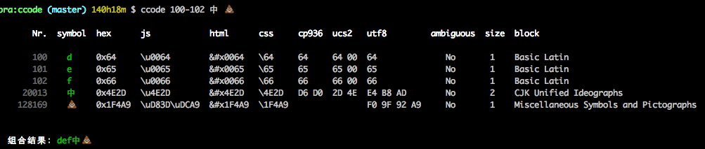
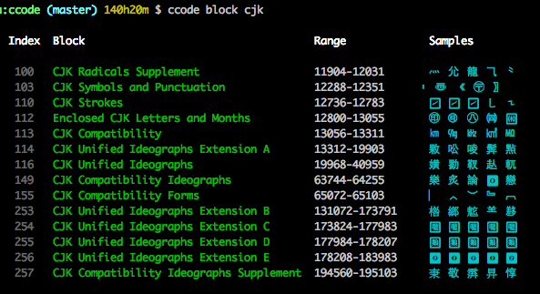
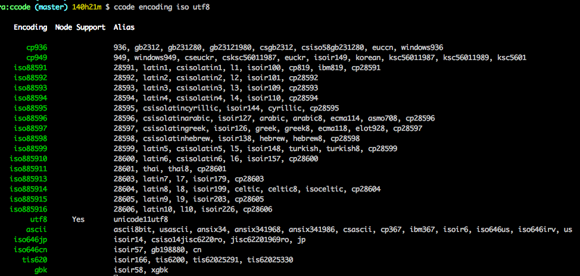
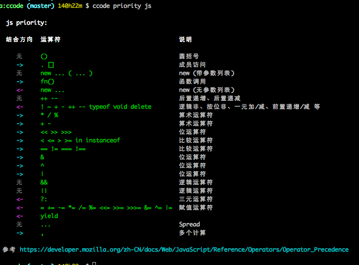

# ccode

程序员命令行工具集！

不适合用于 Windows 用户，Windows CMD终端不支持 Unicode，只支持特定语言，
比如中国用户，在 CMD 上一般只支微软的 [CP936](http://www.unicode.org/Public/MAPPINGS/VENDORS/MICSFT/WINDOWS/CP936.TXT)


## 安装

此项目在开发阶段，经常会添加新功能，但不会经常发布到 npm 上，所以请使用源代码来安装，可执行下面的脚本：

```bash
git clone git@github.com:qiu8310/ccode.git && cd ccode && npm link
```

安装完后可以使用 `ccode -h` 来查看帮助！

## TODO

* [x] 整合 [iconv-lite](https://github.com/ashtuchkin/iconv-lite)
* [x] 整合 [pinyin](https://github.com/hotoo/pinyin)（方法：抓取了 [艺术中国](http://zi.artx.cn/) 中的所有汉字拼音和五笔）
* [ ] Unicode 里有重复的汉字 CJK Compatibility Ideographs 和 CJK Compatibility Ideographs Supplement 区块里的都是重复的
* [ ] 生成日历，风格参考： http://artx.cn/nongli/2017-10-20.28.html
* [ ] 一整套字符相关的工具
* [ ] 输出文件夹的目录结构
* [ ] 生成 html/css 的编码相关的测试页面
* [ ] ᄁ 这个字符是由三个字符组成的，而每个字符单独都有宽度，需要判断哪些字符可以自动组合


## 功能

* 查看单个字符的 Unicode 及编码相关的信息
  
  **上图中：** `ambiguous` 表示是否是[东亚模糊字体](http://unicode.org/reports/tr11/), `size`表示当前字符在此终端上的宽度
* 查看 Unicode 字符的区块（Unicode 将所有字符划分成了 262 个区块）
  
* 查看所有支持的编码信息（主要用了 [iconv-lite](https://github.com/ashtuchkin/iconv-lite) 所支持的编码）
  
* 查看编程语言中的操作符的优先级（目前只支持 `php` 和 `js`）
  
  **提示：** 在 Mac 系统上，可以按住 `CMD`+`CLICK` 快速打开点击的链接或文件


## Code Points 基础知识

> Code points are usually formatted as hexadecimal numbers, 
> zero-padded up to at least four digits, with a U+ prefix.
>
> The possible code point values range from U+0000 to U+10FFFF. That’s over 1.1 million possible symbols. 
> To keep things organised, Unicode divides this range of code points into 17 planes that consist of 
> about 65 thousand code points each.
> 
>
> The first plane (U+0000 → U+FFFF) and is called the **Basic Multilingual Plane** or **BMP**, 
> and it’s probably the most important one, as it contains all the most commonly used symbols. 
> Most of the time you don’t need any code points outside of the BMP for text documents in English. 
> Just like any other Unicode plane, it groups about 65 thousand symbols.
> 
> That leaves us about 1 million other code points (U+010000 → U+10FFFF) that live outside the BMP. 
> The planes these code points belong to are called **supplementary planes**, or **astral planes**.
> 
> **Astral code points** are pretty easy to recognize: if you need more than 4 hexadecimal 
> digits to represent the code point, it’s an astral code point.
>
> 转自 [https://mathiasbynens.be/notes/javascript-unicode#unicode-basics](https://mathiasbynens.be/notes/javascript-unicode#unicode-basics)
>


## DATA

* Unicode 的所有字符：[http://unicode-table.com/en](http://unicode-table.com/en)
* Unicode 官方提供的编码相关的数据：[http://www.unicode.org/Public/UCD/latest/ucd/](http://www.unicode.org/Public/UCD/latest/ucd/)
* Windows Code Page 编码相关的数据：[http://www.unicode.org/Public/MAPPINGS/VENDORS/MICSFT/WINDOWS/](http://www.unicode.org/Public/MAPPINGS/VENDORS/MICSFT/WINDOWS/)
* 本程序内部使用到的数据链接：[src/lib/resource.jsx](./src/lib/resource.jsx)

## DOCS

- [有哪些因素会影响一个 Unicode 字符在终端上的长度](./docs/UNICODE_SIZE_ON_TERMINAL.md)
- [Unicode 知识汇总](./docs/UNICODE.md)
- [Ansi Escape](./docs/ANSI_ESCAPE.md)
- [Locale](./docs/LOCALE.md)

## Reference

- [Unicode 中不同的空格在网站上的秒用](http://www.smashingmagazine.com/2015/10/space-yourself/)
- [Awesome Codepoints](https://github.com/Codepoints/awesome-codepoints)
- [Codepoints.net 的 Github](https://github.com/Codepoints)
- 编码相关的知识可以查看 [iconv-lite](https://github.com/ashtuchkin/iconv-lite) 的 [research 文档](https://github.com/ashtuchkin/iconv-lite/tree/v0.4.10/generation/research)
- [Wiki: Combining Character](https://en.wikipedia.org/wiki/Combining_character)
- [Enocding](https://encoding.spec.whatwg.org/)


