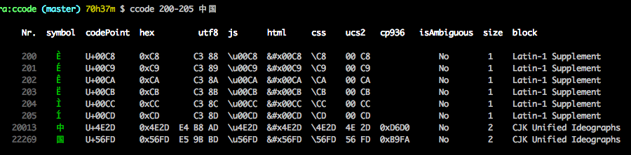
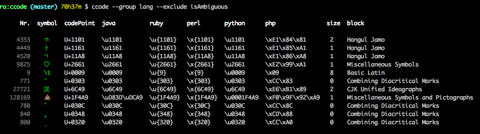

# ccode

显示所有 Unicode 字符在 Mac 终端上的大小，以及和其它编程语言及编码之间的关系。


```
  Nr.  symbol  codePoint  hex             utf8  ucs2   js            html      css     cp936   isAmbiguous  size  block

 4353    ᄁ     U+1101     0x1101      E1 84 81  11 01  \u1101        &#x1101   \1101               No        2    Hangul Jamo
 4449    ᅡ     U+1161     0x1161      E1 85 A1  11 61  \u1161        &#x1161   \1161               No        1    Hangul Jamo
27721    汉     U+6C49     0x6C49      E6 B1 89  6C 49  \u6C49        &#x6C49   \6C49   0xBABA      No        2    CJK Unified Ideographs

```

**不适合用于 Windows 用户，Windows CMD终端不支持 Unicode，只支持特定语言，
比如中国用户，一般只支持 GBK，即微软的 [CP936](http://www.unicode.org/Public/MAPPINGS/VENDORS/MICSFT/WINDOWS/CP936.TXT)**


## TODO

* [ ] 一整套字符相关的工具
* [ ] 输出文件夹的目录结构
* [ ] 生成 html/css 的编码相关的测试页面
* [ ] ᄁ 这个字符是由三个字符组成的，而每个字符单独都有宽度，需要判断哪些字符可以自动组合


## 功能





**支持的编程语言：** `java`, `ruby`, `perl`, `python`, `php`, `html`, `css`, `js`, `es6`

**支持的编码规范：** `utf8`, `utf16`, `utf32`, `ucs2`, `cp437`, `cp936`, `cp950`

**支持的进制：** `binary`, `octal`, `hex`

**其它：** `isAmbiguous`(是否是[东亚模糊字体](http://unicode.org/reports/tr11/)), `size`(当前字符在此终端上的宽度)


**数据：**

* Unicode 相关的数据： [http://www.unicode.org/Public/UCD/latest/ucd/](http://www.unicode.org/Public/UCD/latest/ucd/)
* Windows Code Page 编码相关的数据：[http://www.unicode.org/Public/MAPPINGS/VENDORS/MICSFT/WINDOWS/](http://www.unicode.org/Public/MAPPINGS/VENDORS/MICSFT/WINDOWS/)


## 基础知识

> Code points are usually formatted as hexadecimal numbers, 
> zero-padded up to at least four digits, with a U+ prefix.
>
> The possible code point values range from U+0000 to U+10FFFF. That’s over 1.1 million possible symbols. 
> To keep things organised, Unicode divides this range of code points into 17 planes that consist of 
> about 65 thousand code points each.
> 
>
> The first plane (U+0000 → U+FFFF) and is called the **Basic Multilingual Plane** or **BMP**, 
> and it’s probably the most important one, as it contains all the most commonly used symbols. 
> Most of the time you don’t need any code points outside of the BMP for text documents in English. 
> Just like any other Unicode plane, it groups about 65 thousand symbols.
> 
> That leaves us about 1 million other code points (U+010000 → U+10FFFF) that live outside the BMP. 
> The planes these code points belong to are called **supplementary planes**, or **astral planes**.
> 
> **Astral code points** are pretty easy to recognize: if you need more than 4 hexadecimal 
> digits to represent the code point, it’s an astral code point.
>
> 转自 [https://mathiasbynens.be/notes/javascript-unicode#unicode-basics](https://mathiasbynens.be/notes/javascript-unicode#unicode-basics)
>

## 有哪些因素会影响一个 Unicode 字符在终端上的长度

### 一、终端所使用的编码

Windows 的 CMD 终端为不同国家的用户，实现了一套专门针对此国家的的编码，
比如中国大陆用户的 CMD 终端，一般都是简体中文 [CP936](https://en.wikipedia.org/wiki/Code_page_936) 编码，
而对于台湾同胞，使用的是繁体中文 [CP950](https://en.wikipedia.org/wiki/Code_page_950) 编码，这两种编码中
所, CP936 中大约含有 21920 个字符，而 CP950 中大约含有 21920 个字符，远远低于 Unicode 字符，所以当字符不在
当前终端的编码范围内时，Windows 就默认让此字符占 1 个位置，而在此范围之内的字符，有时占 1 个位置，有时占 2 个
**(具体怎么区分还有待研究?)**。

对于 Mac 终端来说，它可以显示 Unicode 中的所有字符，但不同范围内的字符在终端上的表现是不一样，所占的长度也不一样，
下面几点都是分析 Mac 终端上的不同范围内的字符的长度问题。


```
   Nr.  symbol  cp936   size  block

 20013    中    0xD6D0   2    CJK Unified Ideographs
 22269    国    0xB9FA   2    CJK Unified Ideographs
  9825    ♡              1    Miscellaneous Symbols

  
**从上表中可以看出在 windows 的 CP936 编码范围下，是显示不出 Unicode 中第 9825 个字符的**
```

### 二、修饰字符 Combining Marks

Z͑ͫ̓ͪ̂ͫ̽͏̴̙̤̞͉͚̯̞̠͍A̴̵̜̰͔ͫ͗͢L̠ͨͧͩ͘G̴̻͈͍͔̹̑͗̎̅͛́Ǫ̵̹̻̝̳͂̌̌͘!͖̬̰̙̗̿̋ͥͥ̂ͣ̐́́͜͞


有一类字符，它自己是不占任何空间的，它只是用来修饰它前面的占空间的字符，可以放在被修饰的字符的上面或下面，
所以这类字符在终端上是不占任何位置的，它们的长度都是 0 。


### 三、[东亚字体宽度 East Asian Width](http://unicode.org/reports/tr11/)

文档看的不是很明白，我的理解是，这类字符大体分三种情况

- 固定的长度为 1 的字符
- 固定的长度为 2 的字符
- 还有一类就是在不同的环境下长度可以为 1 也可以为 2 的字符

这个不同的环境一般终端中都会提供个类似这样的选项 `"Treat ambiguous-width characters as double width"`

### 四、可组合的字符 Grapheme Clusters

就是说这类字符本来自己就有宽度，但它可以和另一个字符组合在一起，组合后的长度只是两者中长度最长的一个。
比如 `ᄁ` + `ᅡ` + `ᆨ` => `깍`

```
      Nr.  symbol  codePoint  hex      size  block

     4353    ᄁ     U+1101     0x1101   2    Hangul Jamo
     4449    ᅡ     U+1161     0x1161   1    Hangul Jamo
     4520    ᆨ     U+11A8     0x11A8   1    Hangul Jamo

   组合结果：깍
```

这类字符一般不用特意去计算，因为一般工具都会自动将这类字符 [Normalize](http://unicode.org/reports/tr15/)，
我们所看到的都会是它们合并后的结果。

**另外像很多 emoji 图标也是类似这样，由多个图标可以合并成一个图标(原理是不是一样还有待研究?)**


## 我是如何计算终端上字符长度的

通过 [Ansi Escape](https://en.wikipedia.org/wiki/ANSI_escape_code) 规范，可以获取每个字符前后
所在的终端的坐标，这样就可以计算出此字符的长度。

然后通过此技术，计算所有 0 - 0x10FFFF 个字符的长度，得到它们哪些字符长度是 0，哪些是 1， 哪些是 2 或者更高；
再打开选项 `"Treat ambiguous-width characters as double width"`，再重新计算一遍这些字符的长度，这样
就得到了不同环境下有哪些字符的长度是不一样的，这些字符可以当作 Ambiguous Character。

所以之后，想要知道任何一个字符的长度都没问题。

**但问题是：**如果不用 Ansi Escape 技术，无法得到当前是否设置了 `"Treat ambiguous-width characters as double width"`，
所以也就没办法知道 Ambiguous Character 的长度到底是 1 还是 2 。 而如果采用 Ansi Escape 技术，首先它需要异步，
只是要获取一个字符的长度，还要异步获取，显然体验不好；其次，在 Windows 上用此技术好像还有点问题。


## 其它文档

* [Unicode](./docs/UNICODE.md)
* [Ansi Escape](./docs/ANSI_ESCAPE.md)
* [Locale](./docs/LOCALE.md)

